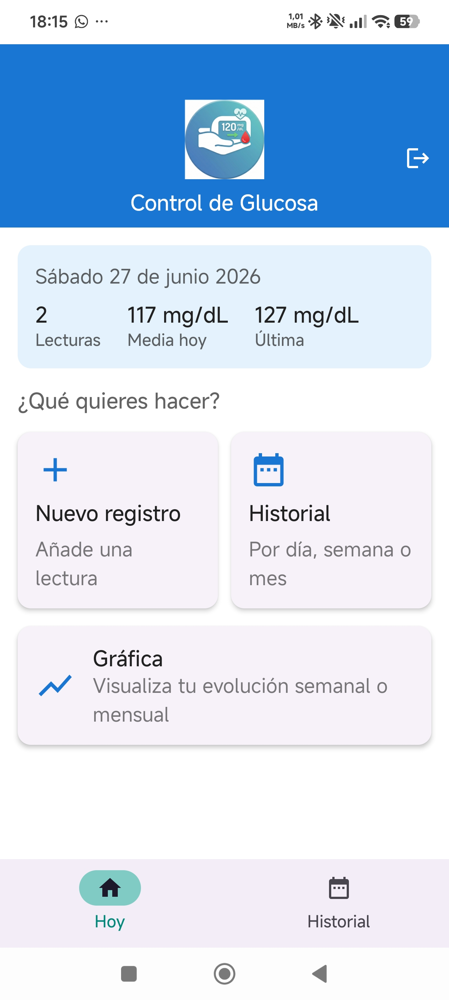
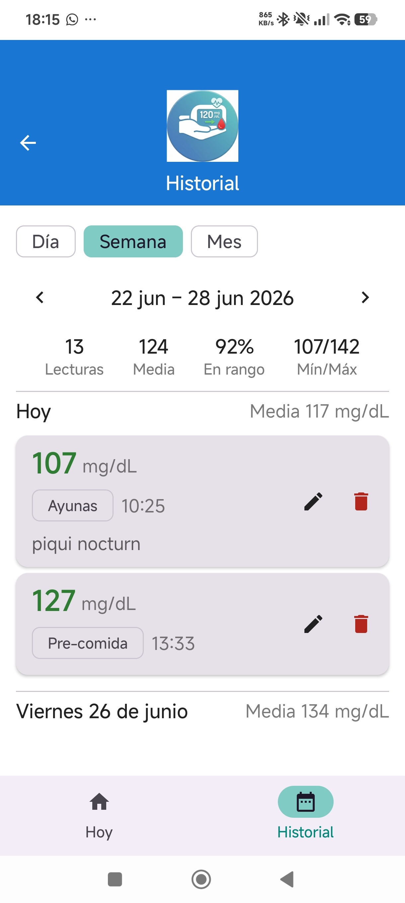
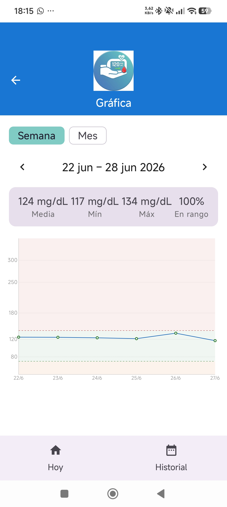
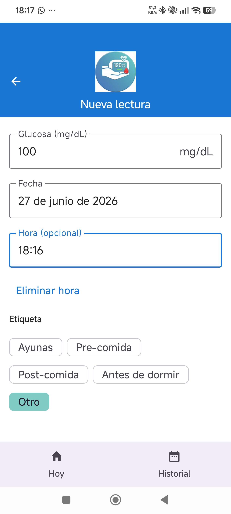
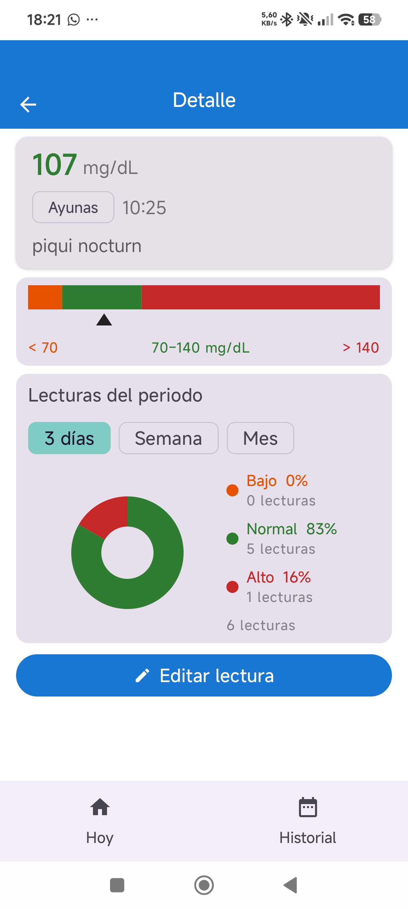
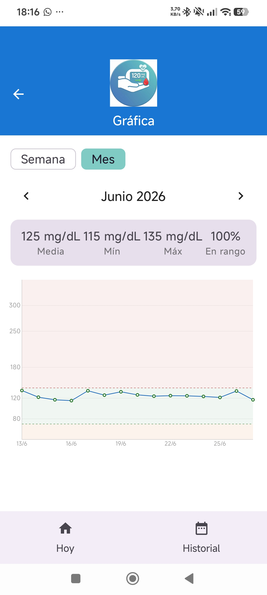

# Control de Glucosa

Aplicación Android para el registro y seguimiento de glucosa en sangre con sincronización en la nube mediante Supabase. Permite registrar lecturas con fecha, hora y etiqueta, visualizar el historial por día/semana/mes, consultar gráficas de evolución y exportar los datos en CSV o PDF.

---

## Capturas de pantalla

<div align="center">

| Dashboard | Historial | Gráfica |
| :---: | :---: | :---: |
|  |  |  |
| **Dashboard diario** | **Historial semanal** | **Gráfica semanal** |

| Nueva lectura | Detalle de lectura | Gráfica mensual |
| :---: | :---: | :---: |
|  |  |  |
| **Formulario de registro** | **Detalle + donut** | **Gráfica mensual** |

</div>

---

## Características

- **Autenticación** — registro e inicio de sesión con email/contraseña; Google Sign-In (pendiente de configurar Web Client ID)
- **Sincronización en la nube** — datos almacenados en Supabase (PostgreSQL); accesibles desde cualquier dispositivo con la misma cuenta
- **Registro de lecturas** — valor mg/dL, fecha, hora opcional, etiqueta (Ayunas, Pre-comida, Post-comida, Antes de dormir…) y notas libres
- **Dashboard** — resumen del día con estado glucémico (bajo/normal/alto) y últimas lecturas; se actualiza en tiempo real al añadir registros
- **Historial** — listado agrupado por día con navegación por día, semana o mes; la lista se actualiza inmediatamente al borrar o editar
- **Detalle de lectura** — barra de estado coloreada (bajo/normal/alto) con cursor triangular + donut de distribución para 3 días, semana o mes del periodo seleccionado
- **Gráfica** — evolución semanal o mensual con zonas de color por rango glucémico
- **Exportación** — CSV (RFC 4180) y PDF (A4 con paginación automática)
- **Recordatorios** — notificaciones periódicas mediante WorkManager configurables en la app
- **Diseño responsive** — BottomBar en móvil, NavigationRail en tablet (≥ 600 dp); orientación portrait bloqueada globalmente

---

## Arquitectura

**Clean Architecture + MVVM** con tres capas estrictas:

```text
domain/        Kotlin puro. Modelos, interfaces de repositorio, casos de uso.
data/          Supabase + Hilt. DTOs, cliente HTTP, implementaciones de repositorio.
presentation/  Jetpack Compose + ViewModels. Pantallas, componentes, navegación.
```

- `domain/` no importa nada de `data/` ni del SDK de Android.
- El mapeo DTO ↔ Domain ocurre únicamente en `data/repository/`.
- Los ViewModels solo invocan casos de uso, nunca el repositorio directamente.
- `GlucoseRepositoryImpl` usa un `MutableSharedFlow<Unit>(replay=1)` como `refreshTrigger`: tras cualquier insert/update/delete llama a `invalidate()`, lo que re-ejecuta todos los Flows activos y actualiza la UI automáticamente.

---

## Stack tecnológico

| Componente | Versión |
| --- | --- |
| Kotlin | 2.2.21 |
| Android Gradle Plugin | 8.x |
| Jetpack Compose BOM | 2026.05.01 |
| Material3 | (incluido en BOM) |
| Supabase BOM | 2.5.4 |
| Ktor (cliente HTTP) | (incluido en BOM) |
| kotlinx.serialization | (incluido en BOM) |
| Hilt | 2.56.2 |
| KSP | 2.2.21-2.0.5 |
| Navigation Compose | 2.9.8 |
| WorkManager | 2.10.1 |
| Coroutines | 1.10.2 |
| JUnit 5 | 5.12.2 |
| MockK | latest |

- **Min SDK:** 26 (Android 8.0) — usa `java.time.*` nativo
- **Target SDK:** 36

---

## Estructura del proyecto

```text
app/src/main/java/com/glucocontrol/
├── MainActivity.kt
├── GlucoControlApp.kt                Configuration.Provider para WorkManager + Hilt
├── data/
│   ├── export/
│   │   ├── CsvExporter.kt            RFC 4180, UTF-8
│   │   └── PdfExporter.kt            A4, paginación automática
│   ├── remote/
│   │   ├── SupabaseClientProvider.kt buildSupabaseClient() — install(Auth) + install(Postgrest)
│   │   └── dto/
│   │       └── GlucoseReadingDto.kt  GlucoseReadingDto / CreateDto / UpdateDto
│   └── repository/
│       ├── AuthRepositoryImpl.kt     signIn / signUp / signOut / getCurrentUser
│       └── GlucoseRepositoryImpl.kt  refreshTrigger + flatMapLatest; insert sin decode
├── di/
│   ├── AppModule.kt
│   ├── SupabaseModule.kt             @Singleton SupabaseClient
│   └── RepositoryModule.kt
├── domain/
│   ├── model/                        GlucoseReading, GlucoseRange, ReadingTag, GlucoseStatus, User
│   ├── repository/                   GlucoseRepository, AuthRepository
│   └── usecase/
│       ├── auth/                     SignInWithEmail, SignUpWithEmail, SignInWithGoogle,
│       │                             SignOut, GetCurrentUser
│       ├── query/                    GetDailyReadings, GetWeekly, GetMonthly, GetByDateRange
│       └── reading/                  AddReading, UpdateReading, DeleteReading, GetReadingById
├── notification/
│   ├── GlucoseReminderWorker.kt      @HiltWorker, POST_NOTIFICATIONS API 33+
│   └── ReminderScheduler.kt          enqueueUniquePeriodicWork
└── presentation/
    ├── component/
    │   ├── AdaptiveNavigation.kt     AppBottomBar (oculta en AuthScreen) / AppNavigationRail
    │   ├── AppTopBar.kt              Barra personalizada con imagen + texto (showImage opcional)
    │   └── GlucoseReadingCard.kt     Modo solo lectura o con acciones (onClick/onEdit/onDelete)
    ├── navigation/
    │   ├── NavGraph.kt               GlucoApp, AppNavHost, navigateTopLevel
    │   └── Screen.kt                 Auth, Home, History, AddEditReading, Chart, ReadingDetail
    ├── screen/
    │   ├── auth/                     AuthScreen (tabs login/registro) + AuthViewModel
    │   ├── addreading/               AddEditReadingScreen + ViewModel
    │   ├── chart/                    ChartScreen + ViewModel (Canvas, semana/mes)
    │   ├── history/                  HistoryScreen + ViewModel
    │   ├── home/                     HomeScreen + ViewModel (dashboard)
    │   └── readingdetail/            ReadingDetailScreen + ViewModel + DetailPeriod
    └── theme/
        ├── Color.kt                  GlucoseLow / Normal / High
        ├── Theme.kt
        └── Type.kt
```

---

## Requisitos de entorno

- Android Studio Hedgehog o superior
- JDK 21 (incluido en el JBR de Android Studio)
- Android SDK con API 36 instalado
- Cuenta en [supabase.com](https://supabase.com) con el proyecto configurado

---

## Configuración inicial

1. Clona el repositorio:
   ```bash
   git clone https://github.com/tonimed/GlucoControl.git
   cd GlucoControl
   ```

2. Crea `local.properties` con la ruta de tu SDK:

   ```properties
   sdk.dir=C\:\\Users\\<tu_usuario>\\AppData\\Local\\Android\\Sdk
   ```

3. Crea `keystore.properties` en la raíz del proyecto (nunca se sube al repositorio):

   ```properties
   storeFile=ruta/al/glucocontrol-release.jks
   storePassword=...
   keyAlias=...
   keyPassword=...
   supabaseUrl=https://<tu-proyecto>.supabase.co
   supabaseAnonKey=<anon-key-de-supabase>
   googleWebClientId=<web-client-id>.apps.googleusercontent.com
   ```

4. En el Dashboard de Supabase, ejecuta el script `supabase-setup.sql` para crear la tabla `glucose_readings` con Row Level Security. Asegúrate de que **"Confirm email"** está desactivado en **Authentication → Providers → Email** para desarrollo.

---

## Comandos de build

```powershell
# Configurar entorno (PowerShell)
$env:JAVA_HOME = "C:\Program Files\Android\Android Studio\jbr"
$env:ANDROID_HOME = "C:\Users\<tu_usuario>\AppData\Local\Android\Sdk"

# Tests unitarios (JVM, sin dispositivo)
.\gradlew.bat :app:testDebugUnitTest

# Tests instrumentados (requiere emulador o dispositivo)
.\gradlew.bat :app:connectedDebugAndroidTest

# APK de release firmado
.\gradlew.bat :app:assembleRelease
# Salida: app/build/outputs/apk/release/app-release.apk

# Android App Bundle (para Google Play)
.\gradlew.bat :app:bundleRelease
# Salida: app/build/outputs/bundle/release/app-release.aab

# Linter
java -jar ktlint-1.8.0.jar --format "app/src/**/*.kt"
java -jar ktlint-1.8.0.jar "app/src/**/*.kt"
```

---

## Tests

Los tests unitarios cubren los 9 casos de uso de glucosa y los 5 de autenticación en la capa `domain/`:

- `AddReadingUseCaseTest` — validación de rango de glucosa y fechas
- `UpdateReadingUseCaseTest`, `DeleteReadingUseCaseTest`, `GetReadingByIdUseCaseTest`
- `GetDailyReadingsUseCaseTest`, `GetWeeklyReadingsUseCaseTest`, `GetMonthlyReadingsUseCaseTest`
- `GetByDateRangeUseCaseTest`, `GetReadingStatsUseCaseTest`
- Tests de autenticación: `SignInWithEmailUseCaseTest`, `SignUpWithEmailUseCaseTest`, etc.

---

## Seguridad

- Las credenciales de firma y Supabase (`keystore.properties`, `*.jks`) están excluidas del repositorio vía `.gitignore`.
- `android:allowBackup="false"` en el Manifest para proteger datos de salud en backups automáticos.
- Los datos se almacenan en Supabase con **Row Level Security (RLS)**: cada usuario solo puede leer y escribir sus propias lecturas (`auth.uid() = user_id`).
- `credentials-play-services-auth` no se incluye en la build para evitar que el sistema muestre automáticamente pop-ups de credenciales de Google en campos de email.

---

## Licencia

Este proyecto es de uso personal y educativo.
